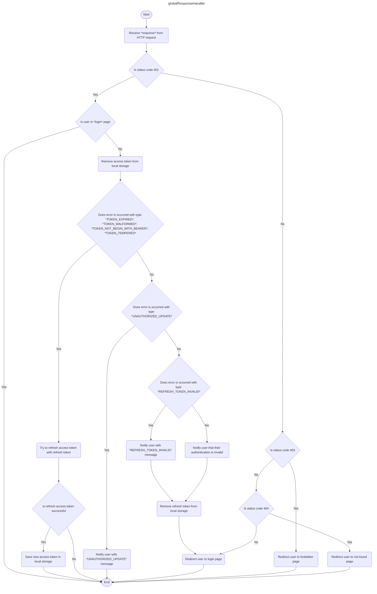

```mermaid
---
title: globalResponseHandler
---
flowchart TD;
    id1([Start])-->id2(Receive *response* from HTTP request)
    id2-->id3{Is status code 401}
    id3-->|Yes|id4{Is user in *login* page}
    id4-->|Yes|id101([End])
    id4-->|No|id5(Remove access token from local storage)
    id5-->id6{Does error is occurred with type *TOKEN_EXPIRED*, *TOKEN_MALFORMED*, *TOKEN_NOT_BEGIN_WITH_BEARER*, *TOKEN_TEMPERED*}
    id6-->|Yes|id7(Try to refresh access token with refresh token)
    id7-->id8{Is refresh access token successful}
    id8-->|Yes|id9(Save new access token in local storage)
    id9-->id101
    id8-->|No|id101
    id6-->|No|id10{Does error is occurred with type *UNAUTHORIZED_UPDATE*}
    id10-->|Yes|id11(Notify user with *UNAUTHORIZED_UPDATE* message)
    id11-->id101
    id10-->|No|id12{Does error is occurred with type *REFRESH_TOKEN_INVALID*}
    id12-->|Yes|id13(Notify user with *REFRESH_TOKEN_INVALID* message)
    id13-->id14(Remove refresh token from local storage)
    id14-->id100(Redirect user to login page)
    id100-->id101([End])
    id12-->|No|id15(Notify user that their authentication is invalid)
    id15-->id14
    id3-->|No|id16{Is status code 403}
    id16-->|Yes|id17(Redirect user to forbidden page)
    id17-->id101
    id16-->|No|id18{Is status code 404}
    id18-->|Yes|id19(Redirect user to not-found page)
    id19-->id101
    id18-->|No|id100
```
