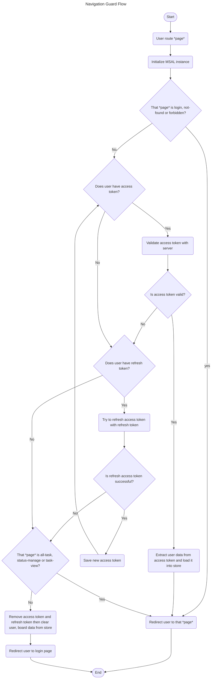

```mermaid
---
title: Navigation Guard Flow
---
flowchart TD;
    id1([Start])-->id2(User route *page*);
    id2-->id102(Initialize MSAL instance);
    id102-->id3{That *page* is login, not-found or forbidden?};
    id3-->|yes|id100(Redirect user to that *page*);
    id3-->|No|id4{Does user have access token?};
    id4-->|Yes|id6(Validate access token with server);
    id6-->id7{Is access token valid?};
    id7-->|No|id12;
    id9-->id10(Redirect user to login page);
    id7-->|Yes|id11(Extract user data from access token and load it into store);
    id11-->id100;
    id100-->id101([End]);
    id10-->id101;
    id4-->|No|id12{Does user have refresh token?};
    id12-->|Yes|id13(Try to refresh access token with refresh token);
    id13-->id14{Is refresh access token successful?};
    id14-->|Yes|id15(Save new access token);
    id15-->id4;
    id14-->|No|id16{That *page* is all-task, status-manage or task-view?};
    id16-->|Yes|id100;
    id16-->|No|id9(Remove access token and refresh token then clear user, board data from store);
    id12-->|No|id16;
```